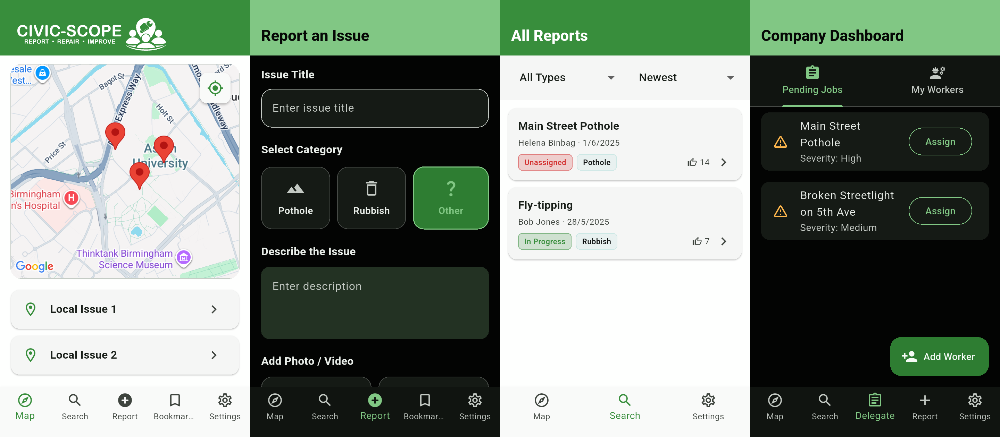
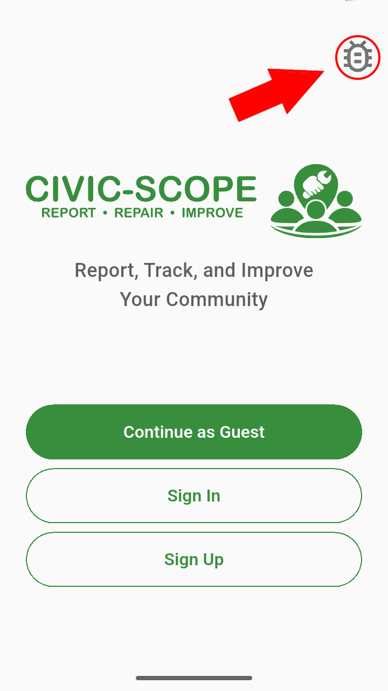
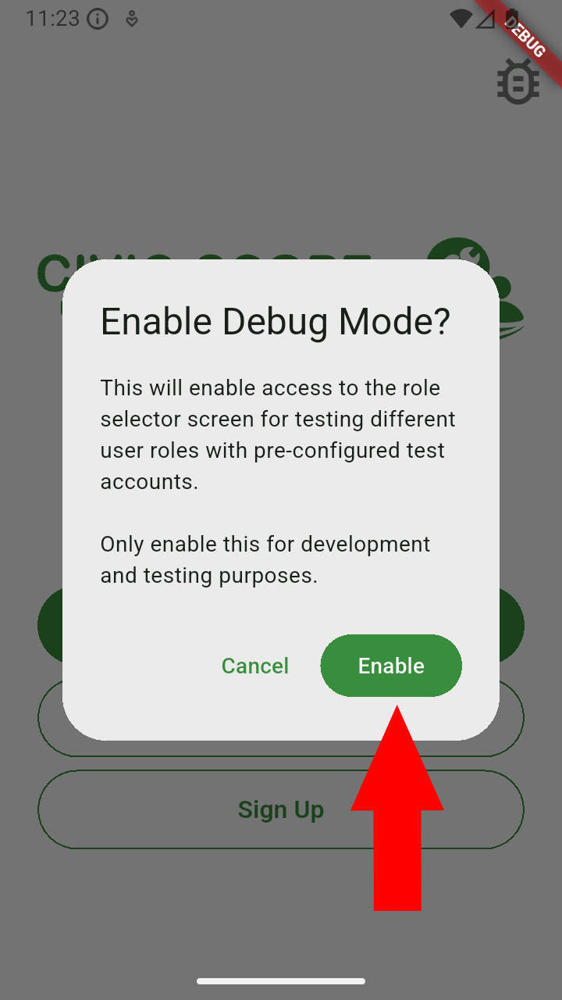
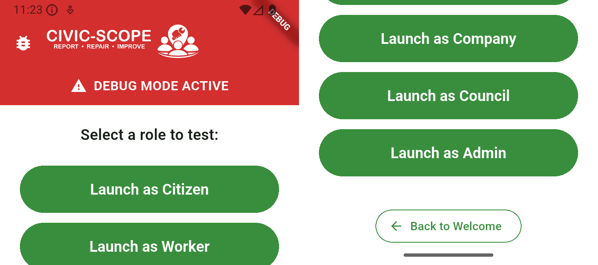
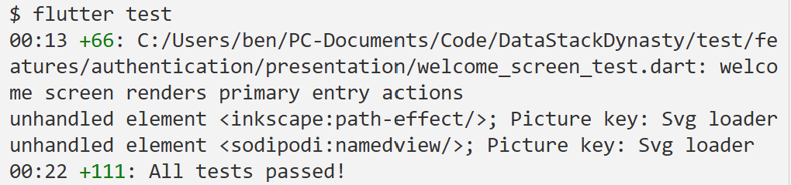
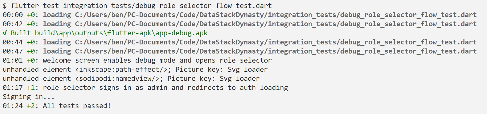

<a href="https://git.cs.bham.ac.uk/software-engineering-2025-26/DataStackDynasty/-/blob/master/assets/centered_banner.svg">
  
</a>

# Information
The Civic-Scope app is a flutter-based mobile first civic reporting system that allows users to report local public infrastructure problems with geotagged photos, view them on an interactive map, vote or contribute funds to prioritise fixes, and track council responses in real time.

It is primarily android focused but should work on ios and web.

# Appearance
<a href="https://git.cs.bham.ac.uk/software-engineering-2025-26/DataStackDynasty/-/blob/master/assets/app_screenshot.png">
  
</a>

Our app has a light and dark theme accessible under the settings tab.

## Tech Stack

- **Flutter**: Cross-platform UI framework
- **Riverpod**: State management 
- **Firebase**: Authentication, Firestore database, Storage
- **Google Maps**: Location selection and map display

## Deferred features

- Councillors need an option to set fund goal and remove comments from reports
- Profile page
- Bookmark page
- ios support for now

## Roles and Heirarchy

The Civic-Scope app is structured hierarchically into 6 distinct user categories ordered from lowest privelages to highest all with different tabs at the bottom with different options for the distinct user roles:

1. Guest Users (the unauthenticated role)
2. Citizens (the core user group who will submit and upvote reports)
3. Workers (the user group responisible for responding to and fixing the issues)
4. Companies (the user group responsible for assigning jobs to workers)
5. Councillors (the user group responsible for assigning companies)
6. Admins (similar to councillors but have additional privelages such as removing erroneous and outdated reports)

The flow is such that councillors must assign a new report to a company and that company must assign a worker.

## How to log in as the different users

These logins are purely for testing purposes for now (since it's a prototype). <br />
You are logged in as a guest by default.

To access a different role either:

### Option 1

1. Click on the debug button in the top right of the welcome screen 

<a href="https://git.cs.bham.ac.uk/software-engineering-2025-26/DataStackDynasty/-/blob/master/assets/instructions/step_1.png">
  
</a>
<a href="https://git.cs.bham.ac.uk/software-engineering-2025-26/DataStackDynasty/-/blob/master/assets/instructions/step_2.png">
  
</a> <br />

2. Select the role you'd like to log in as

<a href="https://git.cs.bham.ac.uk/software-engineering-2025-26/DataStackDynasty/-/blob/master/assets/instructions/step_3.png">
  
</a> <br />

### Option 2

Sign in manually using any these usernames and passwords:

| Role        | Username                | Password     |
|-------------|-------------------------|--------------|
| Citizen     | citizen@example.com     | citizen1     |
| Worker      | worker@example.com      | worker1      |
| Company     | company@example.com     | company1     |
| Councillor  | councillor@example.com  | councillor1  |
| Admin       | admin@example.com       | admin1       |

# Testing scripts
Our project has both unit and integration tests as evidenced below:

<a href="https://git.cs.bham.ac.uk/software-engineering-2025-26/DataStackDynasty/-/blob/master/assets/unit_test_success.png">
  
</a> <br />

For information regarding our unit tests go [here](./UNIT_TESTS_README.md)

<a href="https://git.cs.bham.ac.uk/software-engineering-2025-26/DataStackDynasty/-/blob/master/assets/integration_test_1_success.png">
  
</a> <br />

For information regarding our integration tests go [here](./INTEGRATION_TESTS_README.md)

# Install instructions
## Prerequisites
- Flutter SDK (latest stable version)
- VS Code with Flutter extensions
- Android Phone/Android Studio (for Virtual Machine)
## Setup
### Option 1 (Downloading APK to Android Phone/Emulator)

1. Download all the dependencies
    ```bash
    flutter pub get
    ```

2. Connect phone with USB to computer

3. Copy the APK in lib/Build onto the phone/emulator

4. Install the APK as normal

### Option 2 (Compiling it in VSCode then sending it to an Android Phone)

1. Download all the dependencies
    ```bash
    flutter pub get
    ```

2. Connect phone with USB to computer

3. Build a release version of the app
    ```bash
    flutter build apk
    ```
4. Send the install to your phone
    ```bash
    flutter install
    ```

### Option 3 (Compiling it in VSCode then sending it to an Android Emulator)

1. Download all the dependencies
    ```bash
    flutter pub get
    ```

2. Execute the run command
    ```bash
    flutter run
    ```

For information regarding tests please go to the [tests section](#testing-scripts) and click the links there.